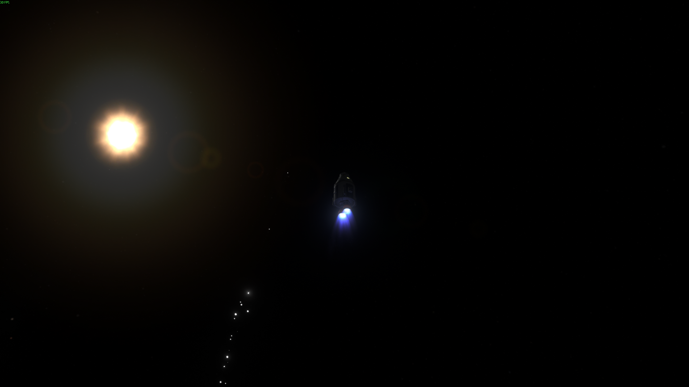
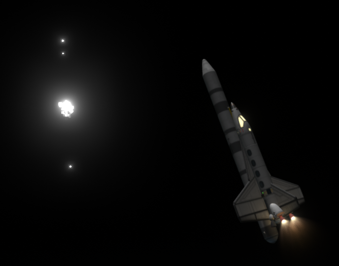

# MTSkies

MTSkies adds rare, mysterious luminous anomalies to Kerbal Space Program. They're designed to be computationally low-cost and cinematic — watch them, track them with the sensor camera, and earn science or funds for good sightings.

## Showcase

## What it does
- Procedural formations: triangles, quads, V-formation, circular/hexagon, lines
- Multiple behavior profiles (Observer, Orbiter, Interceptor, High-G Dart, Pendulum, Mirror, etc.)
- A sensor camera mode with HUD, lock indicators, jittered optics, and continuous tracking rewards
- Timewarp-safe and compatible with TUFX for enhanced visual effects
- Configurable spawn rates, rewards, and effects via `settings.cfg`

## Install
Copy the `GameData/MTSkies` folder into your KSP `GameData/` directory and restart the game.

## Quick controls
- Toggle sensor camera: `Alt + U` (Flight scene)
- Zoom: `+` / `-` (or numpad `+`/`-`)
- Capture / photograph: `P` or `Enter` (won't trigger staging)

When the sensor camera is active you'll see a reticle and two vertical bars that close in as you track a target. When the bars meet the HUD shows `LCKD` and you receive continuous rewards while you maintain the lock.

## Configuration
Edit `GameData/MTSkies/Config/settings.cfg` to adjust behavior and tuning. Useful keys:
- `MaxActiveUaps` — maximum simultaneous anomalies
- `SpawnProbability` — spawn chance per evaluation
- `DefaultGlowIntensity` — glow brightness multiplier
- `DefaultSpawnDistance` — typical spawn standoff distance
- `EnableSensorCamera`, `EnableAudioArtifacts`, `EnableScreenNoise` — toggles for optional effects

## Modding / Extending
Add behaviors by implementing `IUAPBehavior` and dropping the source file into `src/Behaviors/`. The mod will pick up new behavior classes at build time.
